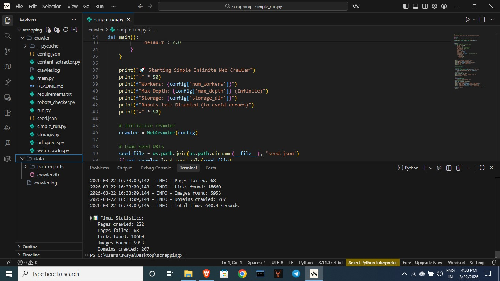
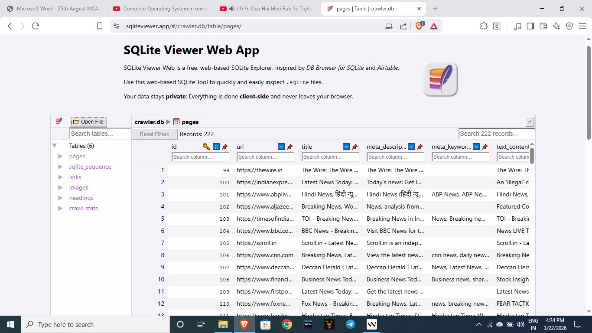

# Web Crawler

A comprehensive, multi-threaded web crawler that respects robots.txt, implements rate limiting, and extracts structured content from websites.

## 🚀 Features

- **Multi-threaded Crawling**: Configurable number of worker threads for efficient crawling
- **Robots.txt Compliance**: Respects website robots.txt rules
- **Rate Limiting**: Configurable delays to prevent overwhelming servers
- **Content Extraction**: Extracts titles, meta descriptions, text content, links, images, and headings
- **Data Storage**: SQLite database with JSON export capabilities
- **Categorized Crawling**: Supports different categories (news, social media, government, etc.)
- **Infinite Mode**: Continuous crawling with configurable depth limits
- **Error Handling**: Robust error handling with retry mechanisms
- **Statistics Tracking**: Real-time crawl statistics and progress monitoring

## 📁 Project Structure

```
crawler/
├── scrapping/
│   └── crawler/
│       ├── main.py              # Main entry point
│       ├── web_crawler.py       # Core crawler class
│       ├── content_extractor.py # HTML content extraction
│       ├── storage.py           # Database operations
│       ├── url_queue.py         # URL queue management
│       ├── robots_checker.py    # Robots.txt compliance
│       ├── config.json          # Configuration file
│       ├── seed.json            # Seed URLs
│       └── requirements.txt     # Python dependencies
├── data/                        # Storage directory
│   ├── crawler.db              # SQLite database
│   └── json_exports/           # JSON exports
├── crawl0.jpg                  # Screenshot 1
├── crawl1.jpg                  # Screenshot 2
└── README.md                   # This file
```

## 🛠️ Installation

1. Clone the repository:
```bash
git clone <repository-url>
cd crawler
```

2. Install dependencies:
```bash
cd scrapping/crawler
pip install -r requirements.txt
```

## 📖 Usage

### Basic Usage

Run the crawler with default settings:
```bash
cd scrapping/crawler
python main.py
python run.py
```

### Advanced Usage

Custom configuration:
```bash
python main.py --config custom_config.json --seeds custom_seeds.json --workers 8 --max-depth 5
```

### Command Line Options

- `--config, -c`: Configuration file path (default: config.json)
- `--seeds, -s`: Seed URLs file path (default: seed.json)
- `--workers, -w`: Number of worker threads
- `--max-depth, -d`: Maximum crawl depth
- `--output, -o`: Output directory for data
- `--dry-run`: Load configuration but don't start crawling
- `--stats`: Show crawl statistics and exit

## ⚙️ Configuration

The crawler is configured via `config.json`:

```json
{
  "max_queue_size": 50000,
  "max_depth": 999,
  "num_workers": 4,
  "default_delay": 1.0,
  "max_retries": 2,
  "request_timeout": 15,
  "storage_dir": "data",
  "save_json": true,
  "export_on_stop": false,
  "infinite_crawl": true,
  "user_agent_rotation": true,
  "respect_robots_txt": true,
  "crawl_delay": {
    "news": 1.0,
    "social_media": 2.0,
    "government": 3.0,
    "default": 1.0
  }
}
```

### Configuration Parameters

- **max_queue_size**: Maximum number of URLs in the queue
- **max_depth**: Maximum crawl depth (999 for infinite)
- **num_workers**: Number of concurrent worker threads
- **default_delay**: Default delay between requests (seconds)
- **max_retries**: Maximum retry attempts for failed requests
- **request_timeout**: Request timeout in seconds
- **storage_dir**: Directory to store crawled data
- **save_json**: Save crawled pages as JSON files
- **export_on_stop**: Export all data to JSON on stop
- **infinite_crawl**: Continue crawling indefinitely
- **user_agent_rotation**: Rotate user agents for requests
- **respect_robots_txt**: Respect robots.txt rules

## 🌐 Seed URLs

Seed URLs are defined in `seed.json` with categories and countries:

```json
{
  "seeds": [
    {
      "category": "news",
      "urls": [
        {"url": "https://www.thehindu.com", "country": "IN"},
        {"url": "https://indianexpress.com", "country": "IN"}
      ]
    }
  ]
}
```

### Supported Categories

- **news**: News websites
- **portals_directories_jobs**: Portals, directories, and job sites
- **social_media**: Social media platforms
- **entertainment_video_images**: Entertainment and media sites
- **government**: Government websites

## 📊 Data Storage

### Database Schema

The crawler stores data in SQLite with the following tables:

- **pages**: Main page content and metadata
- **links**: Discovered links between pages
- **images**: Image URLs found on pages
- **headings**: Page headings (h1-h6)
- **crawl_stats**: Daily crawling statistics

### JSON Export

Each crawled page is also saved as a JSON file in `data/json_exports/` containing:
- URL, title, meta description
- Text content and word count
- Links and images found
- Headings structure
- Crawl metadata

## 🖼️ Screenshots

### Crawler in Action


### Data Output


## 📈 Statistics and Monitoring

The crawler provides real-time statistics:

- Pages crawled and failed
- Links and images discovered
- Domains crawled
- Queue status
- Progress monitoring

View statistics:
```bash
python main.py --stats
```

## 🔧 Dependencies

- **requests**: HTTP library for making requests
- **beautifulsoup4**: HTML parsing and content extraction
- **lxml**: XML and HTML parser
- **fake-useragent**: User agent rotation
- **python-dateutil**: Date utilities

## 🚨 Important Notes

- The crawler respects robots.txt by default
- Rate limiting prevents overwhelming target servers
- SSL verification is disabled for problematic sites
- Use responsibly and ethically
- Check website terms of service before crawling

## 📝 Logging

The crawler logs to:
- Console output (real-time progress)
- `crawler.log` file (detailed logs)

Log levels include:
- INFO: General progress information
- WARNING: Non-critical issues
- ERROR: Critical errors

## 🔄 Stopping the Crawler

Press `Ctrl+C` to gracefully stop the crawler. The crawler will:
- Stop accepting new URLs
- Finish processing current URLs
- Save all collected data
- Display final statistics

## 📊 Performance Tips

1. **Adjust worker count**: Based on your system capabilities
2. **Configure delays**: Balance between speed and politeness
3. **Monitor memory**: Large crawls can consume significant memory
4. **Use infinite mode**: For continuous crawling operations

## 🛡️ Ethical Considerations

- Always respect robots.txt files
- Implement appropriate delays between requests
- Don't overload target servers
- Check website terms of service
- Use crawled data responsibly

## 🐛 Troubleshooting

### Common Issues

1. **SSL Errors**: The crawler automatically retries with HTTP for SSL failures
2. **Timeouts**: Increase `request_timeout` in config
3. **Memory Issues**: Reduce `max_queue_size` or `num_workers`
4. **Rate Limiting**: Increase `default_delay` values

### Debug Mode

Enable debug logging by modifying the logging level in `web_crawler.py`.

## 📄 License

This project is licensed under the MIT License.

## 🤝 Contributing

1. Fork the repository
2. Create a feature branch
3. Make your changes
4. Add tests if applicable
5. Submit a pull request

## 📞 Support

For issues and questions:
- Check the troubleshooting section
- Review the log files
- Open an issue on the repository

---

**Happy Crawling! 🕷️**
